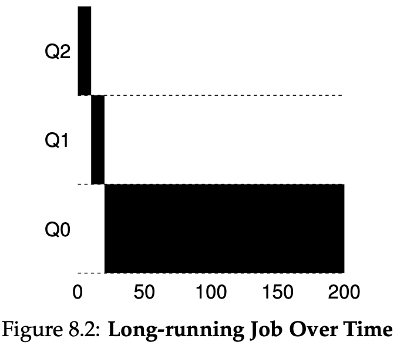

**1. Run a few randomly-generated problems with just two jobs and two queues; compute the MLFQ execution trace for each. Make your life easier by limiting the length of each job and turning off I/Os.**
- Let consider this running `python3 mlfq.py -n 2 -l 0,5,0:1,7,0 -c`
    - It has 2 jobs, 2 queues, the quantum length for each queue is 10, and the
      allotments for each queue is 1. It means after at most 1 * 10 time unit,
      the job's priority is reduced (e.g., moves down one queue)
    - Job1: 
        - startTime 0, runTime 5, ioFreq 0
    - Job2:
        - startTime 1, runTime 7, ioFreq 0
- Statistics:
    - Job1's response time : 0, turnaround : 5 - 0 = 5
    - Job2's response time: 5-1 = 4, turnaround : 12-1 = 11 (1 is startTime, 12
      is endTime)

```shell
python3 mlfq.py -n 2 -l 0,5,0:1,7,0 -c
Here is the list of inputs:
OPTIONS jobs 2
OPTIONS queues 2
OPTIONS allotments for queue  1 is   1
OPTIONS quantum length for queue  1 is  10
OPTIONS allotments for queue  0 is   1
OPTIONS quantum length for queue  0 is  10
OPTIONS boost 0
OPTIONS ioTime 5
OPTIONS stayAfterIO False
OPTIONS iobump False


For each job, three defining characteristics are given:
  startTime : at what time does the job enter the system
  runTime   : the total CPU time needed by the job to finish
  ioFreq    : every ioFreq time units, the job issues an I/O
              (the I/O takes ioTime units to complete)

Job List:
  Job  0: startTime   0 - runTime   5 - ioFreq   0
  Job  1: startTime   1 - runTime   7 - ioFreq   0


Execution Trace:

[ time 0 ] JOB BEGINS by JOB 0
[ time 0 ] Run JOB 0 at PRIORITY 1 [ TICKS 9 ALLOT 1 TIME 4 (of 5) ]
[ time 1 ] JOB BEGINS by JOB 1
[ time 1 ] Run JOB 0 at PRIORITY 1 [ TICKS 8 ALLOT 1 TIME 3 (of 5) ]
[ time 2 ] Run JOB 0 at PRIORITY 1 [ TICKS 7 ALLOT 1 TIME 2 (of 5) ]
[ time 3 ] Run JOB 0 at PRIORITY 1 [ TICKS 6 ALLOT 1 TIME 1 (of 5) ]
[ time 4 ] Run JOB 0 at PRIORITY 1 [ TICKS 5 ALLOT 1 TIME 0 (of 5) ]
[ time 5 ] FINISHED JOB 0
[ time 5 ] Run JOB 1 at PRIORITY 1 [ TICKS 9 ALLOT 1 TIME 6 (of 7) ]
[ time 6 ] Run JOB 1 at PRIORITY 1 [ TICKS 8 ALLOT 1 TIME 5 (of 7) ]
[ time 7 ] Run JOB 1 at PRIORITY 1 [ TICKS 7 ALLOT 1 TIME 4 (of 7) ]
[ time 8 ] Run JOB 1 at PRIORITY 1 [ TICKS 6 ALLOT 1 TIME 3 (of 7) ]
[ time 9 ] Run JOB 1 at PRIORITY 1 [ TICKS 5 ALLOT 1 TIME 2 (of 7) ]
[ time 10 ] Run JOB 1 at PRIORITY 1 [ TICKS 4 ALLOT 1 TIME 1 (of 7) ]
[ time 11 ] Run JOB 1 at PRIORITY 1 [ TICKS 3 ALLOT 1 TIME 0 (of 7) ]
[ time 12 ] FINISHED JOB 1

Final statistics:
  Job  0: startTime   0 - response   0 - turnaround   5
  Job  1: startTime   1 - response   4 - turnaround  11

  Avg  1: startTime n/a - response 2.00 - turnaround 8.00
```

**2. How would you run the scheduler to reproduce each of the examples in the chapter?**
- Example 1: `python3 mlfq.py -n 3 -q 10 -l 0,200,0 -c`



- Example 2: 
    - W/O IO: `python3 mlfq.py -n 3 -q 10 -l 0,200,0:100,20,0 -c`
    - With IO; `python3 mlfq.py -n 3 -q 10 -l 0,200,0:50,20,1 -c`


**3. How would you configure the scheduler parameters to behave just like a round-robin scheduler?**
- The simplest way to make MLFQ behave like RR is to use a single queue
    - There is no lower-priority queue to demote jobs to
- `python3 mlfq.py -n 1 -q 10 -a 1 -c`

**4. Craft a workload with two jobs and scheduler parameters so that one job takes advantage of the older Rules 4a and 4b (turned on with the -S flag) to game the scheduler and obtain 99% of the CPU over a particular time interval.**
- Rule 4a: If a job uses up its allotment while running, its priority is reduced
- Rule 4b: If a job gives up the CPU before the allotment is up, it stays at the
  same priority level
- To take advantage of the scheduler
    - the job should issue an I/O request before its allotment expires
    - a long quantum
- `python3 mlfq.py -n 2 -q 100 -a 1 -i 1 -S -l 0,200,99:0,200,0 -c`

**5. Given a system with a quantum length of 10 ms in its highest queue, how often would you have to boost jobs back to the highest priority level (with the -B flag) in order to guarantee that a single long running (and potentially-starving) job gets at least 5% of the CPU?**
- Call T is the boost time, it means after every T unit times, all of jobs will
  be pushed back to highest priority queue
- With quantum time is 10ms, it means job has 10 ms running time every T ms
- So, to gain 5%, the running time / the duration between each run >= 5% -> `10
  / T >= 0.05 -> T <= 200ms`
